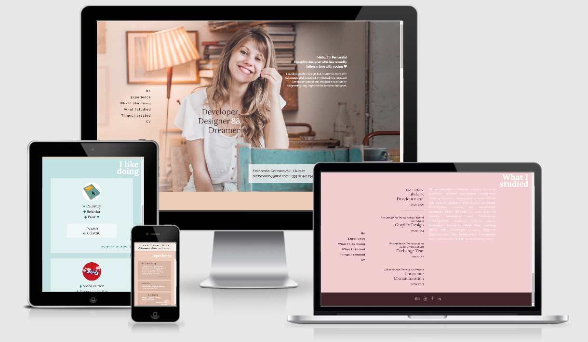
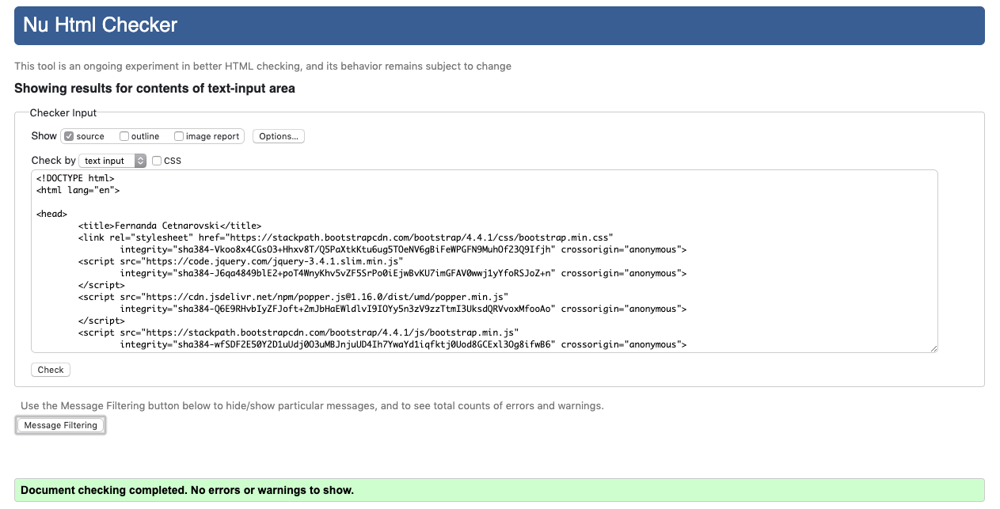
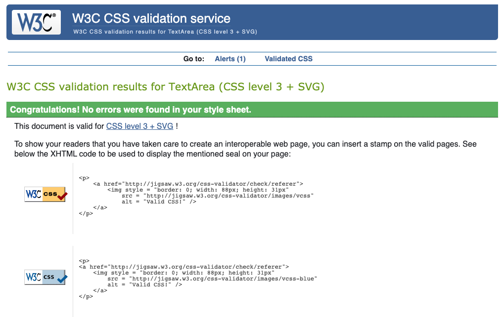

# Fernanda's Resume

This website presents the main information about me. It's structured in 4 parts: Me, Experience, What I like doing and What I studied.
The Me section is a short introduction of who I am and also has my contact information. The Experience part shows my most recent work experience and also my main skills.
What I like doing is the part where I mention subjects I like and personal projects I developed mixing them. Finally, What I studied section brings information about the universities I studied, as well as courses I followed after I graduated. 

The website also has a link to a CV download, in pdf format - available only for desktop view. 
Other than that, there is a link to the Things I created: so far this reference points to my behance portfolio, but for the future this will be reserved to a new section from the website, which is going to show my coding projects.
 
## UX



Use this section to provide insight into your UX process, focusing on who this website is for, what it is that they want to achieve and how your project is the best way to help them achieve these things.
### PROJECT IDEA: Personal portfolio site
The users of this website are mainly recruiters or people that would like to know my work better.

### STRATEGY PLANE

Basic business objectives:
- Atract future employers and colaborators - focus on coding and design
- Create a portfolio easy to be updated
- To have an online id other than social Media
- Feel confident about my work
- Show I'm alaways interested in learning

User needs:
- Understand my work experience
- Get enough information to understand if I can be a good choice to join their team
- Have access to my education history
- Understand my professional profile
- Find all information easily and quickly
- Understand my interests and where I want to go with my career

### SCOPE PLANE

Features:
- Contact info: email, phone number, city
- Social Media: Behance, LinkedIn, YouTube, Facebook.
- Work experience: focus only on design and coding jobs.
- Hobbies and personal projects: 
    - Linguistics + French language + video editing = CocktailF
    - Creativity + bahaviour = My graduation project
    - Thinking outside of the box = how I got my fist job in Ireland, Smartbox CV
    - Other hobbies (less important) = video game, reading, creation, etc.
- Presentation page: photo, a short text explaining from where I come, where I want to go and what motivates me
- Study/University: Graphic Designer, Corporative Communicator, Code institute, self taught in LinkedIn learning and other online platforms
- Languages: I speak (Portuguese, English and French) and I code (Html, CSS, Bootstrap, Javascript, RegEx).
- Skills: Indesign, Photoshop, Illustrator, Premiere Pro, After Effects.

_To be developed to present future coding projects:_
- Portfolio section: Design projects, coding projects and personal projects.

### STRUCTURE PLANE

Find Here the wire frames for the information architecture:
[Wireframe 1](wireframes/STR-1.png)
[Wireframe 2](wireframes/STR-2.png)
[Wireframe 3](wireframes/STR-3.png)
[Wireframe 4](wireframes/STR-4.png)
[Wireframe 5](wireframes/STR-5.png)
[Wireframe 6](wireframes/STR-6.png)

### SKELETON PLANE

Find here the firsts mockups for this project:

[Mockup 1](wireframes/MOCKUP-1.png.png)
[Mockup 2](wireframes/MOCKUP-2.png.png)
[Mockup 3](wireframes/MOCKUP-3.png.png)
[Mockup 4](wireframes/MOCKUP-4.png.png)

### SURFACE

Find the project live on https://fergabi17.github.io/portfolio/

User Stories:
- As a recruiter, I want to download a cv, so I can click on CV.
- As a recruiter, I want to access Fernanda's contact information, so I can click on ME or scroll up to the initial page.
- As a recruiter, I want to check Fernanda's experience, so I can click on EXPERIENCE or scroll down.
- As a recruiter, I want to check Fernanda's education, so I can click on Where I studied or scroll down.
- As a colleague, I want to check Fernanda's interests, so I can click on What I like doing or scroll down.
- As a colleague, I want to acess Fernanda's social media, so I can scroll down until the end of the page.

## Technologies Used

- [Html](https://html.com)
    - The project uses --HTML5-- standard markup language for creating Web pages.

- [CSS](https://www.css3.info)
    - The project uses --CSS3-- to style the website.

- [BOOTSTRAP](https://getbootstrap.com)
    - The project uses the grid system from --BOOTSTRAP-- and also other tools to get the website responsive.

- [Google Chrome](https://www.google.com/chrome/)
    - Browser and developer tools

- [Mozilla Firefox](https://www.mozilla.org/en-US/firefox/new)
    - Browser and developer tools

- [Safari](https://www.apple.com/safari/)
    - Browser and developer tools

- [GitPod](https://https://gitpod.io/)
    - This project was built using gitpod IDE

- [Git](https://git-scm.com/)
    - Used for Version Control

- [GitHub](https://github.com/)
    - Used for Repository

- [Am I Responsive](http://ami.responsivedesign.is)
    - Testing responsiveness of the website

- [Html validator](https://validator.w3.org/nu/#textarea)
    - Validating HTML code

- [Css validator](https://jigsaw.w3.org/css-validator/validator)
    - Validating CSS code

## Testing

Manual tests were made by the developer, the project's mentor and also by potencial users. 
The following browsers were used:
- Google chrome
- Mozilla Firefox
- Safari

The tests included: 
- Functional links
- Links to other websites open on a new tab
- Information easily found
- Readability

The CSS and the HTML codes were validated on jigsaw.w3.org and validator.w3.org




The website is responsive, presenting the content in a different way according to the size of the screen.
Phones and tablets will present:
- A shorter introduction text
- A smaller hero image
- No navigation menu - all navigation is made scrolling the page down
- No access to CV download
- All columns are presented ocuping the full width of the screen

Large screens will show:
- A complete intrudution text
- The full picture for the hero-image section
- A Naviagation menu, to jump straigh away to the content of your interested
- CV download
- Columns can be grouped side by side

## Deployment

This project is hosted on [GitHub](https://github.com/fergabi17/portfolio/)

The git repository contains:
 - README file
 - index.html - that's your homepage
 - Assets folder with images and styles for the website
 - Resurces folder with resources found on the website
 - Wireframes folder that explains the creation process
 
To deploy your own version of the website:
- Have git installed
- Visit the [repository]([GitHub](https://github.com/fergabi17/portfolio/))
- Click 'Clone or download' and copy the code for http
- Open your chosen IDE (Cloud9, VS Code, etc.)
- Open a terminal in your root directory
- Type 'git clone ' followed by the code taken from github repository
    - ```git clone https://github.com/fergabi17/portfolio/```
- When this completes you have your own version of the website
- The website can be run by opening one of the HTML files within a web browser

This site was developed in GitPod.

## Credits

### Media
- The photos used in this site were obtained from Bruna Gosta creations https://www.brunagosta.com/

### Acknowledgements

- I received inspiration for this project from Elizapeth Lin's website https://www.elizabethylin.com/
- Other websites that helped the process with reseach:
    - https://css-tricks.com/
    - https://www.w3schools.com/
    - https://stackoverflow.com/
    - https://github.com/Pattern-Projects/oireachtas-ifd-project/

Thank you for mentorint and suport:
 - Code institute
 - Seun Owonikoko
 - Code institude tutors
