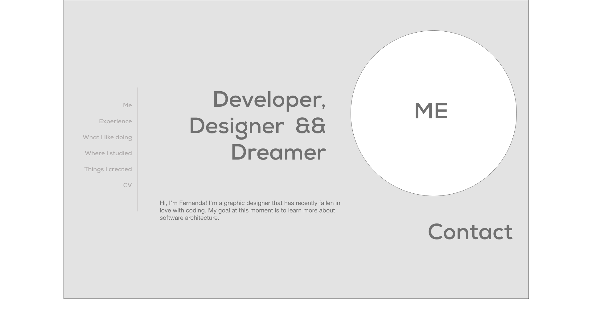
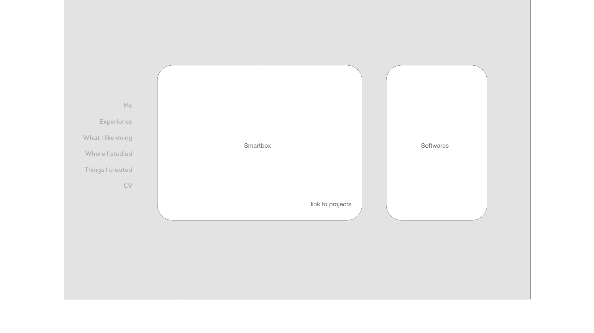
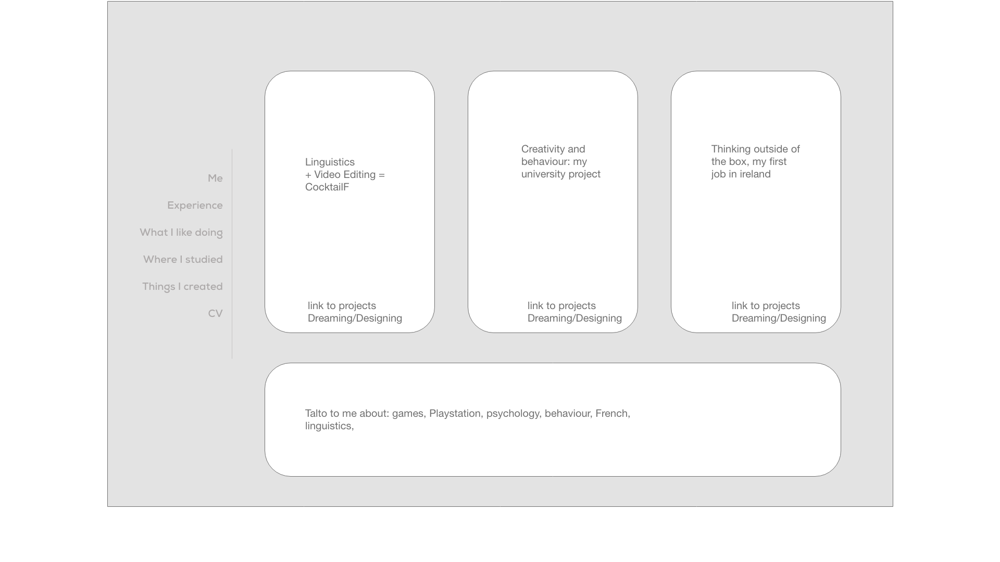
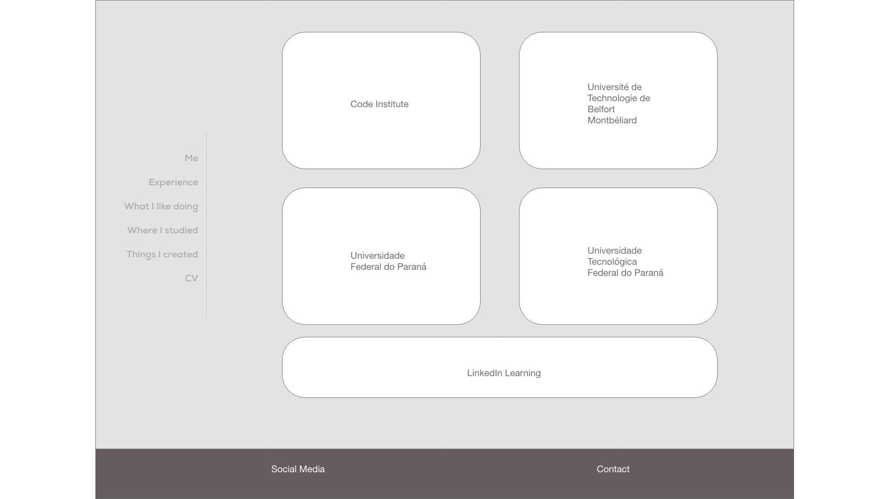
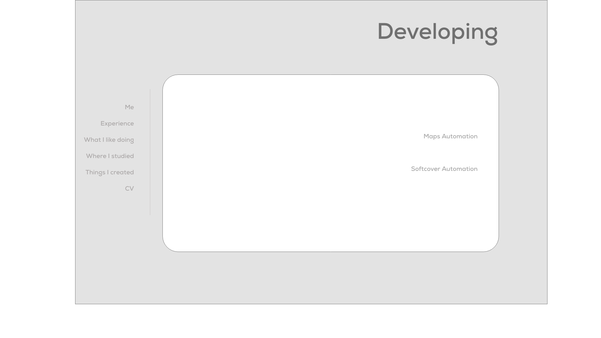
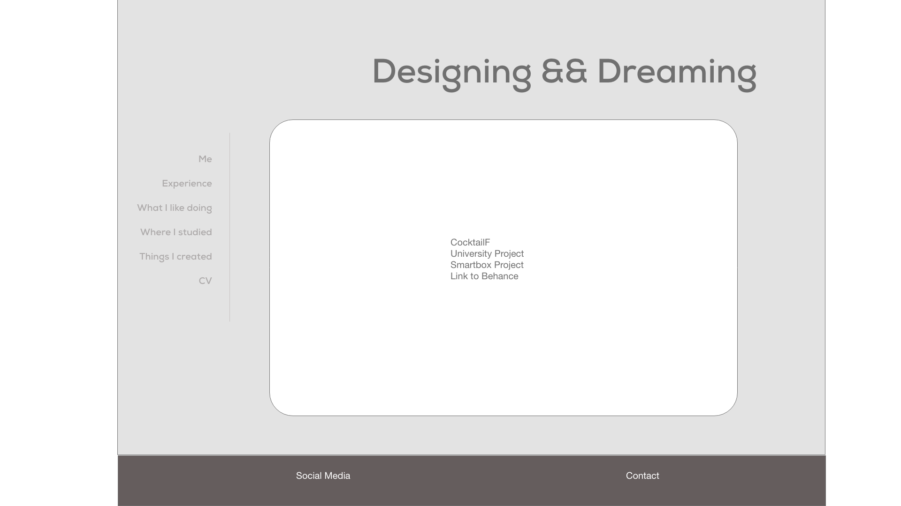
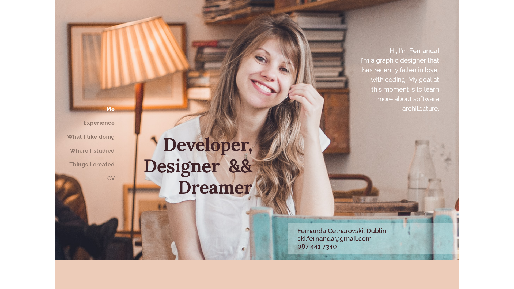
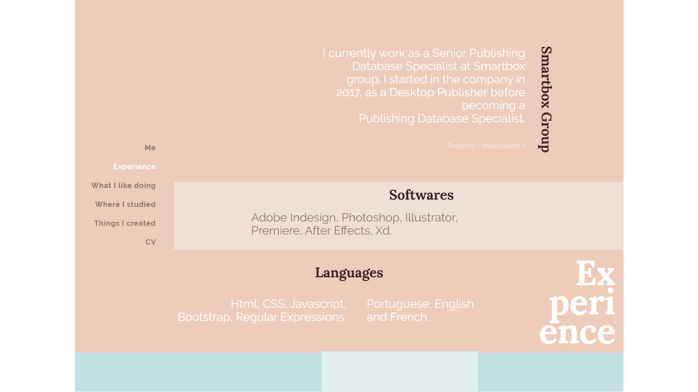
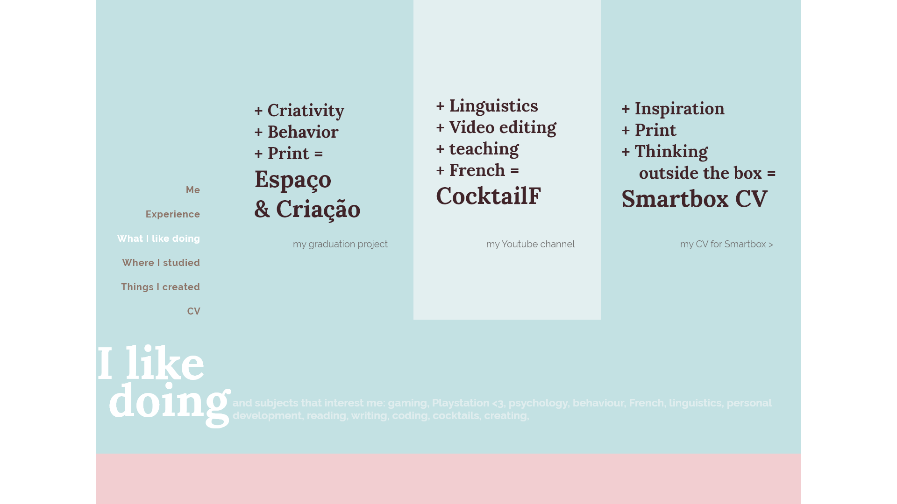
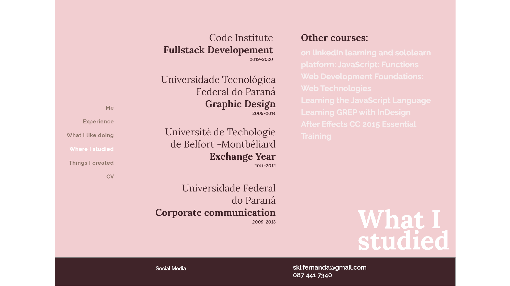

# Fernanda's Resume

This website presents the main information about me. It's structured in 4 parts: Me, Experience, What I like doing and What I studied.
The Me section is a short introduction of who I am and also has my contact information. The Experience part shows my most recent work experience and also my main skills.
What I like doing is the part where I mention subjects I like and personal projects I developed mixing them. Finally, What I studied section brings information about the universities I studied, as well as courses I followed after I graduated. 

The website also has a link to a CV download, in pdf format - available only for desktop view. 
Other than that, there is a link to the Things I created: so far this reference points to my behance portfolio, but for the future this will be reserved to a new section from the website, which is going to show my coding projects.
 
## UX
 
Use this section to provide insight into your UX process, focusing on who this website is for, what it is that they want to achieve and how your project is the best way to help them achieve these things.
### PROJECT IDEA: Personal portfolio site
The users of this website are mainly recruiters or people that would like to know my work better.

### STRATEGY PLANE

Basic business objectives:
- Atract future employers and colaborators - focus on coding and design
- Create a portfolio easy to be updated
- To have an online id other than social Media
- Feel confident about my work
- Show I'm alaways interested in learning

User needs:
- Understand my work experience
- Get enough information to understand if I can be a good choice to join their team
- Have access to my education history
- Understand my professional profile
- Find all information easily and quickly
- Understand my interests and where I want to go with my career

### SCOPE PLANE

Features:
- Contact info: email, phone number, city
- Social Media: Behance, LinkedIn, YouTube, Facebook.
- Work experience: focus only on design and coding jobs.
- Hobbies and personal projects: 
    - Linguistics + French language + video editing = CocktailF
    - Creativity + bahaviour = My graduation project
    - Thinking outside of the box = how I got my fist job in Ireland, Smartbox CV
    - Other hobbies (less important) = video game, reading, creation, etc.
- Presentation page: photo, a short text explaining from where I come, where I want to go and what motivates me
- Study/University: Graphic Designer, Corporative Communicator, Code institute, self taught in LinkedIn learning and other online platforms
- Languages: I speak (Portuguese, English and French) and I code (Html, CSS, Bootstrap, Javascript, RegEx).
- Skills: Indesign, Photoshop, Illustrator, Premiere Pro, After Effects.

_To be developed to present future coding projects:_
- Portfolio section: Design projects, coding projects and personal projects.

### STRUCTURE PLANE

Find Here the wire frames for the information architecture:

### SKELETON PLANE

Find here the firsts mockups for this project:

### SURFACE

Find the project live on https://fergabi17.github.io/portfolio/

User Stories:
- As a recruiter, I want to download a cv, so I can click on CV.
- As a recruiter, I want to access Fernanda's contact information, so I can click on ME or scroll up to the initial page.
- As a recruiter, I want to check Fernanda's experience, so I can click on EXPERIENCE or scroll down.
- As a recruiter, I want to check Fernanda's education, so I can click on Where I studied or scroll down.
- As a colleague, I want to check Fernanda's interests, so I can click on What I like doing or scroll down.
- As a colleague, I want to acess Fernanda's social media, so I can scroll down until the end of the page.

## Technologies Used

- [Html](https://html.com)
    - The project uses --HTML5-- standard markup language for creating Web pages.

- [CSS](https://www.css3.info)
    - The project uses --CSS3-- to style the website.

- [BOOTSTRAP](https://getbootstrap.com)
    - The project uses the grid system from --BOOTSTRAP-- and also other tools to get the website responsive.

## Testing

- Responsiveness

The website is responsive, presenting the content in a different way according to the size of the screen.
Phones and tablets will present:
- A shorter introduction text
- A smaller hero image
- No navigation menu - all navigation is made scrolling the page down
- No access to CV download
- All columns are presented ocuping the full width of the screen

large screens will show:
- A complete intrudution text
- The full picture for the hero-image section
- A Naviagation menu, to jump straigh away to the content of your interested
- CV download
- Columns can be grouped side by side

In this section, you need to convince the assessor that you have conducted enough testing to legitimately believe that the site works well. Essentially, in this part you will want to go over all of your user stories from the UX section and ensure that they all work as intended, with the project providing an easy and straightforward way for the users to achieve their goals.

Whenever it is feasible, prefer to automate your tests, and if you've done so, provide a brief explanation of your approach, link to the test file(s) and explain how to run them.

For any scenarios that have not been automated, test the user stories manually and provide as much detail as is relevant. A particularly useful form for describing your testing process is via scenarios, such as:

1. Contact form:
    1. Go to the "Contact Us" page
    2. Try to submit the empty form and verify that an error message about the required fields appears
    3. Try to submit the form with an invalid email address and verify that a relevant error message appears
    4. Try to submit the form with all inputs valid and verify that a success message appears.

In addition, you should mention in this section how your project looks and works on different browsers and screen sizes.

You should also mention in this section any interesting bugs or problems you discovered during your testing, even if you haven't addressed them yet.

If this section grows too long, you may want to split it off into a separate file and link to it from here.

## Deployment

This section should describe the process you went through to deploy the project to a hosting platform (e.g. GitHub Pages or Heroku).

In particular, you should provide all details of the differences between the deployed version and the development version, if any, including:
- Different values for environment variables (Heroku Config Vars)?
- Different configuration files?
- Separate git branch?

In addition, if it is not obvious, you should also describe how to run your code locally.

## Credits

### Content
- The text for section Y was copied from the [Wikipedia article Z](https://en.wikipedia.org/wiki/Z)

### Media
- The photos used in this site were obtained from ...

### Acknowledgements

- I received inspiration for this project from X
